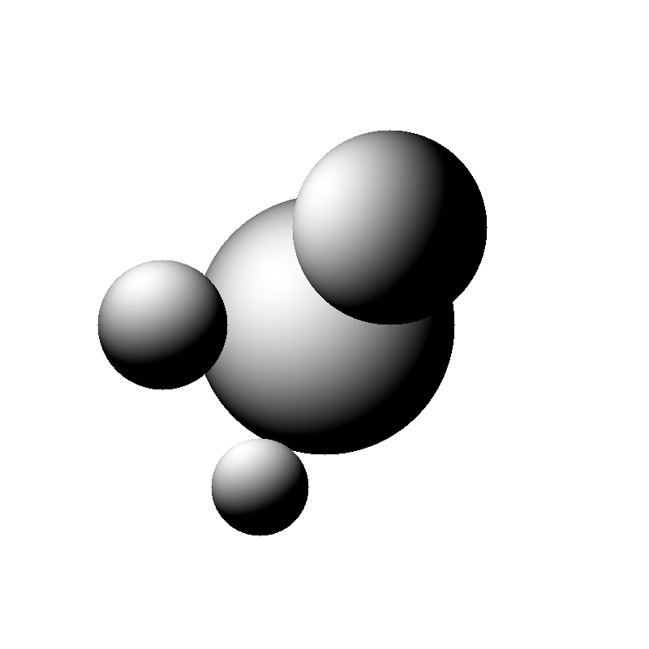
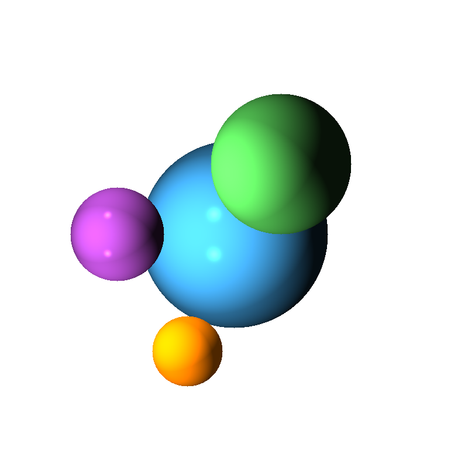
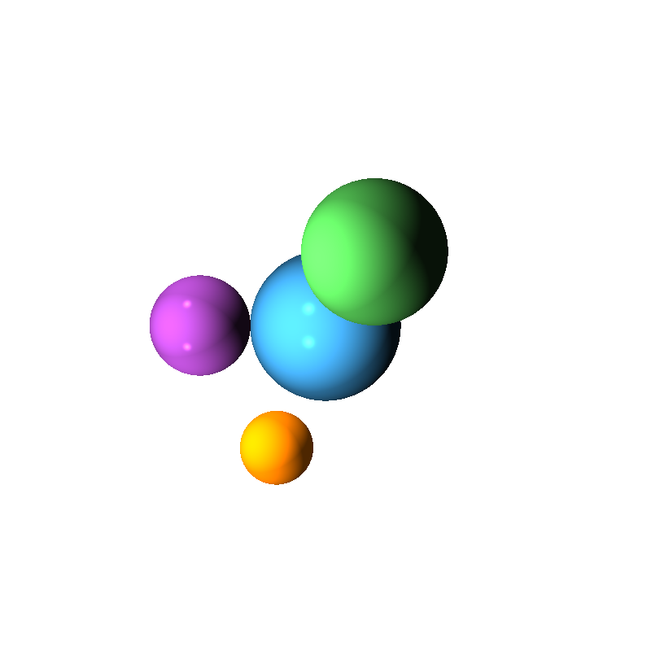
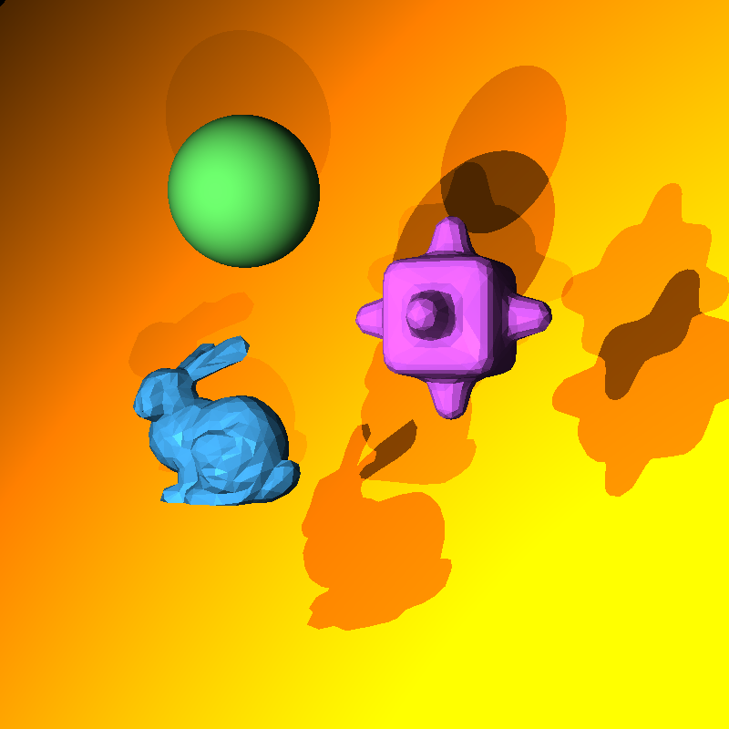

<article class="markdown-body">

\(\newcommand{\A}{\mat{A}}\) \(\newcommand{\B}{\mat{B}}\) \(\newcommand{\C}{\mat{C}}\) \(\newcommand{\D}{\mat{D}}\) \(\newcommand{\E}{\mat{E}}\) \(\newcommand{\F}{\mat{F}}\) \(\newcommand{\G}{\mat{G}}\) \(\newcommand{\H}{\mat{H}}\) \(\newcommand{\I}{\mat{I}}\) \(\newcommand{\J}{\mat{J}}\) \(\newcommand{\K}{\mat{K}}\) \(\newcommand{\L}{\mat{L}}\) \(\newcommand{\M}{\mat{M}}\) \(\newcommand{\N}{\mat{N}}\) \(\newcommand{\One}{\mathbf{1}}\) \(\newcommand{\P}{\mat{P}}\) \(\newcommand{\Q}{\mat{Q}}\) \(\newcommand{\Rot}{\mat{R}}\) \(\newcommand{\R}{\mathbb{R}}\) \(\newcommand{\S}{\mathcal{S}}\) \(\newcommand{\T}{\mat{T}}\) \(\newcommand{\U}{\mat{U}}\) \(\newcommand{\V}{\mat{V}}\) \(\newcommand{\W}{\mat{W}}\) \(\newcommand{\X}{\mat{X}}\) \(\newcommand{\Y}{\mat{Y}}\) \(\newcommand{\argmax}{\mathop{\text{argmax}}}\) \(\newcommand{\argmin}{\mathop{\text{argmin}}}\) \(\newcommand{\a}{\vec{a}}\) \(\newcommand{\b}{\vec{b}}\) \(\newcommand{\c}{\vec{c}}\) \(\newcommand{\d}{\vec{d}}\) \(\newcommand{\e}{\vec{e}}\) \(\newcommand{\f}{\vec{f}}\) \(\newcommand{\g}{\vec{g}}\) \(\newcommand{\mat}[1]{\mathbf{#1}}\) \(\newcommand{\min}{\mathop{\text{min}}}\) \(\newcommand{\m}{\vec{m}}\) \(\newcommand{\n}{\vec{n}}\) \(\newcommand{\p}{\vec{p}}\) \(\newcommand{\q}{\vec{q}}\) \(\newcommand{\r}{\vec{r}}\) \(\newcommand{\transpose}{{\mathsf T}}\) \(\newcommand{\tr}[1]{\mathop{\text{tr}}{\left(#1\right)}}\) \(\newcommand{\s}{\vec{s}}\) \(\newcommand{\t}{\vec{t}}\) \(\newcommand{\u}{\vec{u}}\) \(\newcommand{\vec}[1]{\mathbf{#1}}\) \(\newcommand{\x}{\vec{x}}\) \(\newcommand{\y}{\vec{y}}\) \(\newcommand{\z}{\vec{z}}\) \(\newcommand{\0}{\vec{0}}\) \(\renewcommand{\v}{\vec{v}}\) \(\renewcommand{\hat}[1]{\widehat{#1}}\)

# CS-GY-6533 Computer Graphic: Ray Tracing ## Data Structures Let's first talk about the data structures that I created and is using in this assignment. The main idea here is that we consider each principle element that constructs a part of the scene as a individual class, and define those classes in `.h` files. > `scene_elements.h` > `material.h` > `sphere.h` > `triangle.h` > `tri_mesh.h` > `plane.h` ### scene_elements.h `scene_elements.h` is where I defined general elements that construct the scene. A Ray has origin (eye) and direction (d). Both of these two attributes are Eigen vector with 3 doubles. > class Ray { > public: > Eigen::Vector3d origin; > Eigen::Vector3d direction; > }; Object is a class to be implemented by Sphere, Triangle, TriMesh and Plane. It has a not implemented method call `ray_intersect` which takes in a Ray instance as input and returns a bool indicating whether this object is hitted by the given ray. If it is hit, then at meantime it will output t and n, which are respectively the parameterized distance of ray from origin to intersection point and the normal at the intersection point. In addition, Object has a material attribute that specifies the material features (ka, kd, ks, km and phong exp) that this object is using. > class Object { > public: > Material* material; > virtual bool ray_intersect(const Ray & ray, double & t, Eigen::Vector3d & n, const double t0) const = 0; > }; Light has point and intensity. `reverse_light` computes the distance and direction from a given point in 3d to the origin of the light source. > class Light { > public: > Eigen::Vector3d p; > double intensity; > void reverse_light(const Eigen::Vector3d & query, Eigen::Vector3d & direction, double & distance) const; > }; Consider a scene as a sandbox, given a ray, the scene will response with: id: index of obj that was hit by ray. t: parameterized distance n: normal of the hit point. > class Response { > public: > int id; > double t; > Eigen::Vector3d n; > }; ### material.h `material.h` is where I defined Materials with `ambient`, `diffuse`, `specular`, `mirror` and `phong exp`. > class Material { > public: > // Ambient, Diffuse, Specular, Mirror Color > Eigen::Vector3d ambient; > Eigen::Vector3d diffuse; > Eigen::Vector3d specular; > Eigen::Vector3d mirror; > double exp; // Phong exponent > }; ### shpere.h A sphere is defined by a center (c) and radius (r). > class Sphere : public Object { > public: > double r; > Eigen::Vector3d c; > // check if the ray intersects the sphere > bool ray_intersect(const Ray & ray, double & t, Eigen::Vector3d & n, const double t0) const; > }; ### triangle.h A triangle is defined by three vectors in 3d (p0, p1, p2). > class Triangle : public Object { > public: > Eigen::Vector3d p0; > Eigen::Vector3d p1; > Eigen::Vector3d p2; > // check if the ray intersects the sphere > bool ray_intersect(const Ray & ray, double & t, Eigen::Vector3d & n, const double t0) const; > }; ### tri_mesh.h A triangle mesh is defined by a vector of many triangles. > class TriMesh : public Object { > public: > std::vector <object*>meshes; > bool ray_intersect(const Ray & ray, double & t, Eigen::Vector3d & n, const double t0) const; > }; ## Generic Functions I also defined some generic functions that are commonly used for the purpose of generalizing in the computational process of ray tracing. > `closest_intersection.h` > `shading.h` > `read_off.h` > `define_scene.h` ### closest_intersection.h Given a Ray, vector of Objects, return a boolean indicating whether some object is hitted by this ray. if some objects are hitted, find the hit with smallest t and its matching obj id, and normal. pack these as Response and modify the passed in pointer > bool closest_intersection( > const Ray & r, > const std::vector & objs, > Response* & obj_response, > const double t0); ### shading.h `shading.h` will do: first inspect whether the ray intersect any object in vector. If not find any intersection, return false without modifying any input variables. if find intersect, return true and modify the input rgb variable. All the computations goes here. That's it. > bool shading( > const Ray & ray, > Eigen::Vector3d & rgb, > const std::vector & objects, > const std::vector & lights, > const int nth_reflection, > const double t0, > const bool & enable_shadow, > const bool & enable_mirror); ### read_off.h `read_off.h` will read an OFF file into a V and F. V is a Eigen Matrix of double and F is a Eigen matrix of integer. > bool read_off(const std::string filename, Eigen::MatrixXd & V, Eigen::MatrixXi & F); ### define_scene.h `define_scene.h` defines functions for each scene that generally takes in a vector of Object pointer and a vector of Light pointer and initiate the instance that these pointer is pointing to. > bool read_off(const std::string filename, Eigen::MatrixXd & V, Eigen::MatrixXi & F); ## Part 1 The goal of this part is to let our program support rendering for spheres in general positions. In this part, orthographic viewing ray and simple Lambertian shading are used.

<figure>

<figcaption>Running `./Assignment1_bin` should produce this image.</figcaption>

</figure>

## Part 2 The first goal of this part is to assign each sphere in the previous scene a material feature. This is done by the file `define_scene.h` and among these spheres, the green and orange spheres are purely diffuse. This is done by setting the `diffuse` vector3d to be zeros. The purple and blue spheres use diffuse and specular shading, so we can see the specular illumination on the surface. The second goal is to add another light source. This is done by pushing another Light instance to the lights vector that defines all the lights in the scene.

<figure>

<figcaption>Running `./Assignment1_bin` should produce this image.</figcaption>

</figure>

## Part 3 In the previous part we are still using orthographic viewing ray, the only thing that is changed in this part is that now we want to use perspective ray. This can be accomplished by constructing Ray instances with different directions and all of these Rays should have a fixed origin.

<figure>

<figcaption>Running `./Assignment1_bin` should produce this image.</figcaption>

</figure>

## Part 4 In Part 4 we are tracing triangle meshes instead of sphere, this seems totally different, but in fact they are similar. First of all is to read the OFF files in memory. Generally, OFF file supports mesh of quadrangle, pentagon...... but for this assignment i only consider triangle. These tasks are done by calling `read_off.h`. Then consider a triangle mesh as a whole object (let's say the bummy.off), ray tracing this object is the same as ray tracing a "scene" with a lot of triangles, which is just like tracing a lot of spheres. except that for the Response from scene, we are getting (id, t, normal) from triangles.

<figure>

<figcaption>Running `./Assignment1_bin` should produce this image.</figcaption>

</figure>

## Part 5 First of all, in part 5 our ray tracer needs to support tracing for all general object types (sphere, triangle, mesh and plane, which is additional). This can be done easily because of the parent Object type that is used. Then for adding shadow to our scene, i pass in a flag variable `enable_shadow` to the `shading` function to separate the computation of plain color and the computation of color that involving shadow. The process is: for each pixel, and for each light, before we compute the diffuse and specular value added by this light, we judge if or not this pixel is in the shadow of this light. If it is, then we don't add diffuse and specular, instead, we add (0,0,0) which is dark. If it is not shadow, then we add the diffuse and specular as usual. Note that, a pixel in the shadow of one light doesn't means that it is totally dark, for the reason that it could be illuminated by other lights, but if a pixel is not illuminated by any light, then it will only have the color of `ambient`.

<figure>

<figcaption>Running `./Assignment1_bin` should produce this image.</figcaption>

</figure>

## Part 6 To add a mirror to the scene in this part, I created a plane made of material with high `mirror` value and high `specular` value. Then similar to part 5 i also pass in a flag variable `enable_mirror` to separate the computation of mirror effect and regular rendering. In addition to that, i specify a limit. The limit restrict the recursion depth that this function can run into. Without considering the mirror, when we are shooting a ray, what we get from the scene is just a rgb value. Now assuming the ray we shoot hits a mirror, the color we are getting is what this mirror should look like (let's name it rgb1) and it is the color that we would definitely add to the final rgb. Now because it is a mirror, we also need to consider the reflective ray. As stated in many resources, this is same as looking from the mirror and looking towards to reflective direction. Then, this will give another color, the color we get from the reflective ray. let's call it rgb2\. The final rgb for this pixel is essentially rgb1 + m * rgb2, where m is the `mirror` coefficient. But wait...... the reflective ray can also hit another thing that is reflective, then the recursion won't end. That why we need to specify a limit.

<figure>

<figcaption>Running `./Assignment1_bin` should produce this image.</figcaption>

</figure>

## Part 7 Part 7 is the parallelized implementation of part 6 using tbb. The first we need to do is to include the tbb to our project. I place the cloned tbb source code into the `../ext` folder and add these lines to `CMakeLists.txt`. > include(../ext/tbb/cmake/TBBGet.cmake) > tbb_get(TBB_ROOT tbb_root CONFIG_DIR TBB_DIR) > find_package(TBB REQUIRED tbb) > target_link_libraries(${PROJECT_NAME}_bin ${TBB_IMPORTED_TARGETS})

<figure>

<figcaption>Running `./Assignment1_bin` should produce this image.</figcaption>

</figure>

## Part 8 Animated scene from part 6 by moving the camera in circle around the scene. The animated gif is created by combining 80 key frames where each key frame is shifted by k * 5° from the origin position. After getting all the images, run the following two lines sequentially to produce the output .gif file. > convert -delay 10 -loop 0 $(ls part8-*.png | sort -V) animated.gif > rm part8-*.png

<figure>

<figcaption>Running `./Assignment1_bin` should produce this image.</figcaption>

</figure>

## How To Run? Within the zx979 folder: > cd Assignment_1 > mkdir build > cd build > cmake -DCMAKE_BUILD_TYPE=Release ../ > make > ./Assignment1_bin</object*></article>
